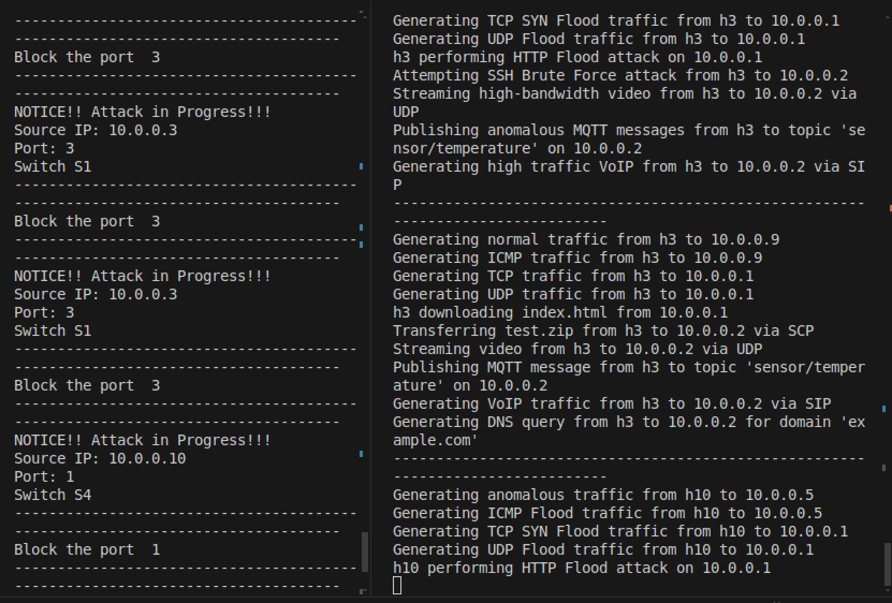
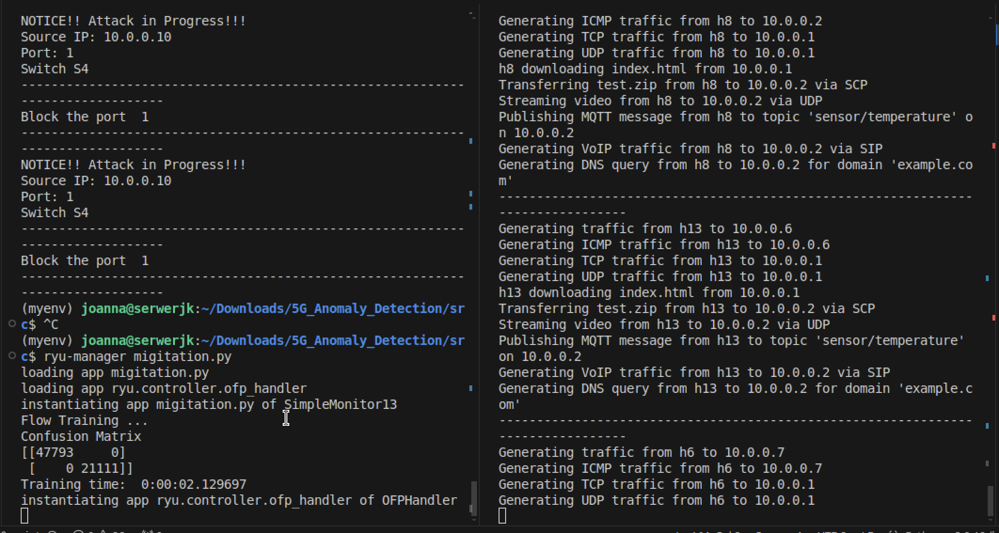
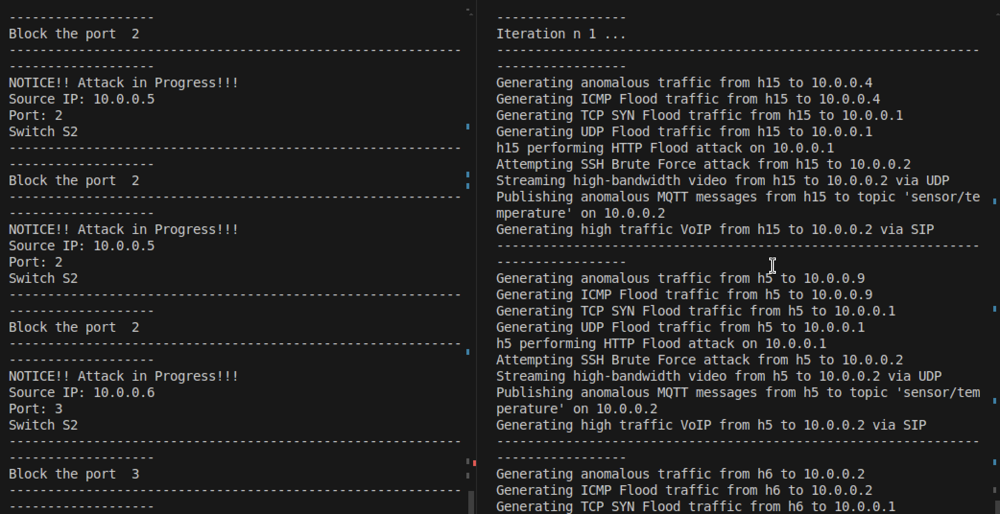

# Wykrywanie i łagodzenie anomalii w sieciach 5G z wykorzystaniem uczenia maszynowego 

Ten projekt implementuje system do wykrywania i łagodzenia ataków DDoS w sieciach 5G za pomocą technik uczenia maszynowego. Wykorzystuje kontroler SDN oparty na frameworku Ryu oraz modele uczenia maszynowego do analizy ruchu sieciowego i wykrywania anomalii.

## Spis treści
- [Technologie](#Technologie)
- [Struktura projektu](#Struktura-projektu)
- [Uruchamianie projektu](#Uruchomienie-projektu)
- [Wybrane ataki](#Wybrane-ataki)
- [Zbieranie danych](#Zbieranie-danych)
- [Uczenie Maszynowe](#Uczenie-Maszynowe)
- [Przeciwdziałanie](#Przeciwdziałanie)
- [Przykład działania](#Przykład-działania)
## Technologie
- VirtualBox (Ubuntu)
- Python 3.7.17
- Setuptools 44.1.0
- Virtualenv
- Ryu SDN Framework
- Mininet
- Scikit-learn
- Pandas
- Matplotlib
- Hydra
- FFmpeg
- SIPP
- Mosquitto
## Struktura projektu

```
├── src
│   ├── anomaly_controller.py
│   ├── anomaly_traffic.py
│   ├── controller.py
│   ├── FlowStatsfile.csv
│   ├── migitation.py
│   ├── mininet
│   │   ├── Downloads
│   │   │   └── index.html
│   │   └── test.zip
│   ├── ML.py
│   ├── normal_controller.py
│   ├── normal_traffic.py
│   ├── PredictFlowStatsfile.csv
│   ├── sipp
│   ├── ssh
│   │   └── rockyou.txt
│   ├── switchm.py
│   ├── switch.py
│   ├── test_traffic.py
│   ├── videos
│   │   └── video.mp4
│   └── webserver
│       └── index.html
```

## Uruchomienie projektu
Najpierw należy sprawdzić swój adres IP i zmienić go w kodzie kontrolerów.
```bash 
ifconfig 
#198.162.XX.XX 
```
Trzeba aktywować wirtualne środowisko w jednym terminalu
```bash 
source myenv/bin/activate
```
W tym samym terminalu trzeba uruchomić wybrany kontroler ryu.
```bash
ryu-manager migitation.py
```
W drugim terminalu uruchamiamy naszą sieć mininet:
```bash
sudo python3 normal_traffic.py

```
## Wybrane anomalie w sieciach

- ICMP Flood: Generowanie nadmiernej liczby pingów (ping flood), co ma na celu przeciążenie ofiary dużą ilością żądań ICMP.

- TCP SYN Flood: Atak polegający na wysyłaniu dużej liczby pakietów TCP SYN, co ma na celu zajęcie zasobów serwera poprzez nieukończone połączenia.

- UDP Flood: Atak typu flood, który wysyła dużą ilość pakietów UDP do serwera, co ma na celu przeciążenie serwera i spowodowanie jego awarii.

- HTTP Flood: Generowanie nadmiernych żądań HTTP w krótkim czasie, co prowadzi do przeciążenia serwera internetowego.

- SSH Brute Force: Próba wielokrotnego logowania się do serwera SSH przy użyciu różnych haseł, co ma na celu złamanie zabezpieczeń logowania (atak siłowy).

- Strumieniowanie wideo: Generowanie ruchu strumieniowania wideo o wysokiej przepustowości, co przeciąża sieć i zasoby serwera.

- MQTT Flood (IoT): Publikowanie dużej liczby złośliwych wiadomości MQTT, co prowadzi do przeciążenia systemu komunikacji IoT.

- VoIP Flood: Generowanie wysokiego ruchu VoIP (SIP), co prowadzi do przeciążenia serwera obsługującego połączenia VoIP.
## Zbieranie danych

### Wykorzystane pliki:

- `normal_traffic.py`
- `anomaly_traffic.py`
- `normal_controller.py`
- `anomaly_controller.py`
- `switch.py`

Aby zebrać dane potrzebne do uczenia naszego modelu potrzebny będzie uruchomiony kontroler oraz symulacja fizycznej sieci. Kontroler monitoruje sieć i zbiera dane do pliku `FlowStatsfile.csv`.
## Uczenie Maszynowe

### Wykorzystane pliki

- `ML.pl`

Dane są najpierw pobierane z pliku csv. Są odpowiednio przetwarzane oraz wczytywane przy użyciu biblioteki `pandas`. Dane dzielone na dane treningowe i testowe. Zaimplementowane są różne modele ML:

- `Logistic Regression (LR)`
- `K-Nearest Neighbors (KNN)`
- `Naive Bayes (NB)`
- `Decision Tree (DT)`
- `Random Forest (RF)`

Każda z metod uruchamia odpowiedni model i trenuje go na danych. Dla każdego modelu wykonywana jest predykcja na danych testowych. Wyświetlana jest macierz konfuzji oraz dokładność modelu (sukces i porażka). Czas uczenia i predykcji jest mierzony i wyświetlany. Na podstawie pliku `ML.pl` wybierany jest najlepszy model do naszej detekcji, najbardziej efektywny, najszybszy i najdokładniejszy jednocześnie.


## Przeciwdziałanie

Plik `migitation.py` służy do monitorowania i analizy ruchu sieciowego, czyli jest kontrolerem. Rozszerza funkcjonalność klasy SimpleSwitch13 z pliku `switchm.py`. Zbiera statystyki ruchu ze switchy i zapisuje je do pliku `PredictFlowStatsfile.csv`.

Wczytuje dane z pliku `FlowStatsfile.csv` i trenuje wybrany model uczenia maszynowego (RandomForestClassifier), który służy do wykrywania anomalii.

W zależności od wyniku predykcji, skrypt decyduje, czy występuje anomalia, i uruchamia proces łagodzenia (mitigacji) ataku.

Jeśli model wykryje anomalię, oznacza to potencjalny atak. Wtedy uruchamiany jest proces blokowania portu, przez który odbywa się złośliwy ruch.

`Switchm.py` pełni rolę przełącznika. Przełącznik uczy się, gdzie są podłączone urządzenia, zapamiętując adresy MAC i porty, na których wykryto ruch. Przełącznik rozpoznaje pakiety różnych typów, takich jak ARP, IP, ICMP, TCP, UDP.

Tworzy odpowiednie reguły przepływu, które kontrolują, jak pakiety powinny być przekazywane przez przełącznik. W przypadku wykrycia ataku, może zablokować port lub adres IP na danym przełączniku, zatrzymując szkodliwy ruch.
## Przykład działania

Poniżej przedstawione jest działanie programu. Po prawej generowany jest ruch z pliku `test_traffic.py`. Po lewej uruchomiony jest kontroler do wykrywania anomalii w sieci i do łagodzenia ataków. Ruch normalny i ataki generowane są naprzemiennie.



W kolejnym przypadku mamy uruchomiony plik `normal_traffic.py`, który generuje ruch wyłącznie normalny. Po lewej widzimy, że nic nie zostało wyświetlone w terminalu. Tak powinno być, żaden atak nie został wykryty, dlatego nic się nie generuje.



Ostatni przypadek to ruch tylko i wyłącznie złośliwy. Plik `anomaly_traffic.py` generuje rózne przypadki ruchu z anomaliami. Wyświetlane są komunikaty odnośnie tego jaki jest adres źródłowy, z jakiego przełacznika i z jakiego portu generowany jest złośliwy ruch oraz jaki port został zablokowany w celu łagodzenia ataku.



